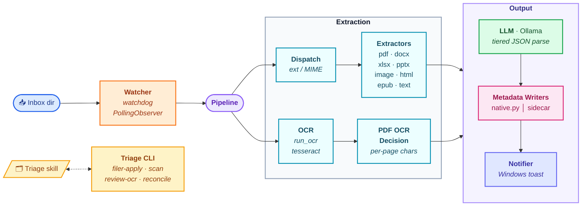

# Architecture



## Data flow

1. A file lands in `<documents_root>/<inbox_dir>`.
2. `watcher` debounces creation/move events for `watch_settle_seconds`,
   verifies size stability, then dispatches to `pipeline.process_file`.
3. `pipeline.process_file` calls `dispatch.extract` to choose an extractor by
   suffix (or MIME, via `python-magic`).
4. The extractor returns an `ExtractedDoc` containing text, native metadata
   (if any), and an OCR recommendation.
5. If OCR is recommended, `ocr.run_ocr` is invoked (Tesseract for images;
   `pdf2image` + Tesseract for PDFs).
6. `llm.enrich` calls Ollama. The response is parsed via tiered fallbacks:
   strict → repair → retry → regex → placeholder.
7. The metadata is written via `metadata.native.write` (with mtime
   preserved) when the format supports it; otherwise via
   `metadata.sidecar.write`. Native-bearing files **also** get a sidecar so
   the in-tree memory is consistent.
8. A debounced toast announces the change.

## Scanner

`automafile scan` walks the tree, builds a hash index (cached by
`(mtime, size)` in `storage/scan/hash-index.json`), and emits a worklist
JSON to `storage/scan/scan-<ts>.json`. It identifies:

- `files_needing_ocr` — text-layer-less PDFs, images without metadata.
- `files_needing_metadata` — supported types with no sidecar/native data.
- `files_with_partial_metadata` — sidecars missing required fields.
- `files_with_stale_metadata` — file mtime newer than `metadata_modified`.
- `ocr_review_candidates` — files OCR'd with a different engine/lang.
- `orphan_sidecars` — sidecars whose target file is missing, with hash
  matches in the tree.
- `unprocessable_files` — encrypted PDFs, etc.

## Memory

Project-local memory lives in [memory/](memory/). The `/triage` skill
reads `preferences.md`, `taxonomy.md`, and `corrections.jsonl` on every
invocation and updates them when the user overrides a proposal.

## Run modes

The pipeline is deployable two ways without code changes:

- **Native venv** on Windows (host). Direct OS access; toast notifications
  fire via `windows-toasts`.
- **Linux container** (Docker / Podman). Bind-mounts `<documents_root>` to
  `/docs` and the project workspace to `/workspace`. Reaches the host's
  Ollama via `host.docker.internal:11434`. Notifications fall back to
  stdout (no headless-container notification bridge).

The choice is purely about isolation — the container variant exists so an
agent (Claude Code or otherwise) running inside it cannot reach files
outside the bind-mounts.

`automafile.ocr._resolve_tesseract_bin` validates that any configured path
actually exists before honoring it, so the host's `config.jsonc` (with a
Windows path) does not break the Linux container — the resolver falls
through to `shutil.which("tesseract")` instead.

## mtime preservation

Every native-metadata writer wraps its work in `metadata.mtime.preserve_times`,
which captures `(atime_ns, mtime_ns)` before writing and restores via
`os.utime(..., ns=...)` after. The file's content hash will change (OneDrive
re-syncs the new bytes); Explorer's "Date modified" stays at the original.
```
