# Architecture

```mermaid
flowchart LR
   inbox(["📥 Inbox dir"]):::source
   watcher["<b>Watcher</b><br/><i>watchdog<br/>PollingObserver</i>"]:::watch
   pipeline(["<b>Pipeline</b>"]):::core

   subgraph extract ["<b>Extraction</b>"]
      direction TB
      dispatch["<b>Dispatch</b><br/><i>ext / MIME</i>"]:::stage
      extractors["<b>Extractors</b><br/>pdf · docx<br/>xlsx · pptx<br/>image · html<br/>epub · text"]:::stage
      ocr["<b>OCR</b><br/><i>run_ocr<br/>tesseract</i>"]:::stage
      ocr_decision["<b>PDF OCR<br/>Decision</b><br/><i>per-page chars</i>"]:::stage
   end

   subgraph output ["<b>Output</b>"]
      direction TB
      llm["<b>LLM</b> · Ollama<br/><i>tiered JSON parse</i>"]:::ai
      writers["<b>Meta Store</b><br/><i>upsert docs+ocr<br/>FTS5 mirror</i>"]:::write
   end

   db[("<b>data/dragndoc.db</b><br/><i>docs · ocr · events<br/>triage_queue · docs_fts</i>")]:::journal
   toaster["<b>Toaster</b><br/><i>host process<br/>polls events.id</i>"]:::notify

   cli["<b>CLI</b><br/><i>digest · scan · review<br/>meta get/cat/set/edit · grep<br/>mv · cp · rm · ls<br/>triage list/next/done</i>"]:::tool
   triage[/"🗂️ Triage skill"/]:::tool

   inbox --> watcher --> pipeline
   pipeline --> dispatch --> extractors --> output
   pipeline --> ocr --> ocr_decision --> output
   llm --> writers
   writers -->|upsert| db
   writers -.->|enqueue| db
   db -->|poll by id| toaster
   triage <-.-> cli
   style extract fill:#f8fafc,stroke:#94a3b8,stroke-width:2px,color:#0f172a
   style output fill:#f5f3ff,stroke:#a78bfa,stroke-width:2px,color:#312e81

   classDef source  fill:#dbeafe,stroke:#2563eb,stroke-width:2px,color:#1e3a8a
   classDef watch   fill:#ffedd5,stroke:#f97316,stroke-width:2px,color:#9a3412
   classDef core    fill:#ede9fe,stroke:#8b5cf6,stroke-width:2px,color:#5b21b6
   classDef stage   fill:#ecfeff,stroke:#0891b2,stroke-width:2px,color:#164e63
   classDef ai      fill:#dcfce7,stroke:#16a34a,stroke-width:2px,color:#14532d
   classDef write   fill:#fce7f3,stroke:#db2777,stroke-width:2px,color:#9d174d
   classDef journal fill:#fef9c3,stroke:#ca8a04,stroke-width:2px,color:#713f12
   classDef notify  fill:#e0e7ff,stroke:#6366f1,stroke-width:2px,color:#3730a3
   classDef tool    fill:#fef3c7,stroke:#f59e0b,stroke-width:2px,color:#92400e
```



## Data flow

1. A file lands in `<docs>/<inbox>`.
2. `watcher` debounces creation/move events for `watch.settle` seconds,
   verifies size stability, then dispatches to `pipeline.digest_file`.
3. `pipeline.digest_file` calls `dispatch.extract` to choose an extractor by
   suffix (or MIME, via `python-magic`).
4. The extractor returns an `ExtractedDoc` containing text and an OCR
   recommendation.
5. If OCR is recommended, `ocr.run_ocr` is invoked (Tesseract for images;
   `pdf2image` + Tesseract for PDFs).
6. `llm.enrich` calls Ollama. The response is parsed via tiered fallbacks:
   strict → repair → retry → regex → placeholder.
7. Metadata is upserted into `data/dragndoc.db` via `meta_store.upsert` —
   one row in `docs` keyed by relative path, one row in `ocr` (if OCR was
   considered). The original document is never touched. SQLite triggers
   keep `docs_fts` (FTS5 over `title`/`summary`/`notes`/`tags`/`parties`)
   in sync automatically.
8. The pipeline enqueues the file in `triage_queue` (one row per `doc_id`,
   stamped with `enqueued_at`). The `/triage` skill drains this queue via
   `dnd triage next` / `dnd triage done`. Removing a `docs` row cascades
   into `triage_queue`; `dnd mv` doesn't (the row's path simply updates).
9. Run-state events are appended to `events`: `digest_started` /
   `digest_finished` and `scan_started` / `scan_finished`. The pipeline
   never renders notifications itself.

## Storage layout

```text
data/
├── dragndoc.db          # SQLite, WAL-mode, locally-backed-up
├── tessdata/            # Tesseract language packs
├── runtime/             # watch.pid, watch.disabled
├── logs/                # dragndoc.log
└── toaster.cursor       # last-seen events.id (small int)
```

The `data/` directory is **never** placed on OneDrive. SQLite + sync
providers don't mix safely. Backups of `data/` are user-managed and
periodic; corruption is recoverable from backup or by re-running the
pipeline against the documents tree (which rebuilds metadata from
extraction + LLM, but loses any user edits since the last backup).

## Toaster

`dnd toaster` is a separate, long-running consumer of the `events`
table. It polls `SELECT id, ts, kind, payload FROM events WHERE id > ?
ORDER BY id LIMIT 500` once per second, persists the highest-seen id to
`data/toaster.cursor` after every fired toast (so restarts never miss
or duplicate), and renders Windows toasts via the debounced `Notifier`.

The tray status line is built from three signals:

- A `digest_started` / `scan_started` event sets a "Digesting…" /
  "Scanning…" label; the matching `_finished` event clears it.
- When idle, the line shows "N files ready for triage" — read directly
  from `triage_queue` (inbox-scope by default).
- Falls back to the most recent toast title/body, then `Idle`.

Only `digest_finished` (when `ready_count > 0`) and `error` events
trigger Windows toasts. Run-state events update the status line
silently; that way a tree-level digest produces one notification at the
end ("4 files ready for triage") instead of one per file.

This decoupling lets the pipeline run inside a container while the
toaster runs on the host — the bind-mounted `data/` directory is the
only shared surface needed (the toaster opens the SQLite file
read-only).

## Triage queue

`triage_queue` holds the doc_ids that are awaiting filing — one row per
`docs.id`, stamped with `enqueued_at` and a short `reason` ("digested",
"rebuild"). The pipeline writes here on every successful `digest_file`;
the `/triage` skill drains it by calling `dnd triage next` (peek) and
then `dnd triage done <abs-path>` after `dnd mv`.

Default scope is inbox-only: `dnd triage list/count/next/clear` filter to
`<inbox>/%` paths so /triage doesn't disturb already-filed documents.
`--all` widens to the whole tree (used during taxonomy reorganisations).
`dnd triage rebuild` is a one-shot migration aid that seeds the queue
from existing `docs` rows.

Foreign-key cascade keeps things tidy: `dnd rm` deletes the queue row
along with the `docs` row; `dnd mv` only updates the row's path, leaving
the queue entry intact (still pending until /triage explicitly removes
it).

## Scanner

`dnd scan` walks the tree and produces an in-memory `Worklist`
describing what `digest` would do:

- `files_needing_ocr` — text-layer-less PDFs, images without a row.
- `files_needing_metadata` — supported types with no `docs` row.
- `files_with_partial_metadata` — rows missing required fields.
- `files_with_stale_metadata` — file mtime newer than the row's
  `modified` (the file's mtime captured at last digest).
- `ocr_review_candidates` — rows whose `engine_ver` / `langs` differ
  from the current settings.
- `missing_files` — `docs` rows whose `path` no longer resolves to a
  file on disk; `dnd review orphans` proposes hash-matched relinks.
- `unprocessable_files` — encrypted PDFs, etc.

The worklist is never persisted to disk; callers consume it directly.

## Memory

Project-local memory lives in [memory/](memory/). The `/triage` skill
reads `preferences.md`, `taxonomy.md`, and `corrections.jsonl` on every
invocation and updates them when the user overrides a proposal.

## Run modes

The pipeline is deployable two ways without code changes:

- **Native venv** on Windows (host). Direct OS access; the watcher and
  toaster run as separate foreground processes.
- **Linux container** (Docker / Podman). Bind-mounts `<docs>`
  to `/docs` and the project's `data/` directory through the workspace
  mount. Reaches the host's Ollama via `host.docker.internal:11434`. The
  toaster always runs on the host regardless of mode — it polls
  `data/dragndoc.db` through the bind-mounted workspace, so toasts
  surface natively even when the pipeline is containerized.

`dragndoc.ocr._resolve_tesseract_bin` validates that any configured path
actually exists before honoring it, so the host's `config.jsonc` (with a
Windows path) does not break the Linux container — the resolver falls
through to `shutil.which("tesseract")` instead.

## The DB is the only metadata store

Original documents are never modified — the pipeline reads them, never
writes back. All extracted/enriched metadata lives in `data/dragndoc.db`.
Consequences:

- File content hashes and mtimes are stable (no need to snapshot/restore
  timestamps around writes).
- Moves go through `dnd mv <src> <dst>` so the row's `path` follows the
  file. A raw `mv` / `move` produces an orphan row that `dnd review
  orphans` can later relink by content hash.
- Sharing a document with someone else means sending just the file —
  metadata stays in your local DB.
- Backups: back up `data/` independently of the documents tree (the
  documents tree itself can ride OneDrive; the DB cannot).
