# Architecture

```mermaid
flowchart LR
   inbox(["📥 Inbox dir"]):::source
   watcher["<b>Watcher</b><br/><i>watchdog<br/>PollingObserver</i>"]:::watch
   pipeline(["<b>Pipeline</b>"]):::core

   subgraph extract ["<b>Extraction</b>"]
      direction TB
      dispatch["<b>Dispatch</b><br/><i>ext / MIME</i>"]:::stage
      extractors["<b>Extractors</b><br/>pdf · docx<br/>xlsx · pptx<br/>image · html<br/>epub · text"]:::stage
      ocr["<b>OCR</b><br/><i>run_ocr<br/>tesseract</i>"]:::stage
      ocr_decision["<b>PDF OCR<br/>Decision</b><br/><i>per-page chars</i>"]:::stage
   end

   subgraph output ["<b>Output</b>"]
      direction TB
      llm["<b>LLM</b> · Ollama<br/><i>tiered JSON parse</i>"]:::ai
      writers["<b>Sidecar Writer</b><br/><i>.meta/&lt;name&gt;.md</i>"]:::write
   end

   events[("<b>events.jsonl</b><br/><i>storage/</i>")]:::journal
   toaster["<b>Toaster</b><br/><i>host process<br/>cursor + compact</i>"]:::notify

   cli["<b>Triage CLI</b><br/><i>inspect · mv · filer-apply<br/>scan · review-ocr · reconcile</i>"]:::tool
   triage[/"🗂️ Triage skill"/]:::tool

   inbox --> watcher --> pipeline
   pipeline --> dispatch --> extractors --> output
   pipeline --> ocr --> ocr_decision --> output
   llm --> writers
   writers -->|append| events
   events -->|tail| toaster
   triage <-.-> cli
   style extract fill:#f8fafc,stroke:#94a3b8,stroke-width:2px,color:#0f172a
   style output fill:#f5f3ff,stroke:#a78bfa,stroke-width:2px,color:#312e81

   classDef source  fill:#dbeafe,stroke:#2563eb,stroke-width:2px,color:#1e3a8a
   classDef watch   fill:#ffedd5,stroke:#f97316,stroke-width:2px,color:#9a3412
   classDef core    fill:#ede9fe,stroke:#8b5cf6,stroke-width:2px,color:#5b21b6
   classDef stage   fill:#ecfeff,stroke:#0891b2,stroke-width:2px,color:#164e63
   classDef ai      fill:#dcfce7,stroke:#16a34a,stroke-width:2px,color:#14532d
   classDef write   fill:#fce7f3,stroke:#db2777,stroke-width:2px,color:#9d174d
   classDef journal fill:#fef9c3,stroke:#ca8a04,stroke-width:2px,color:#713f12
   classDef notify  fill:#e0e7ff,stroke:#6366f1,stroke-width:2px,color:#3730a3
   classDef tool    fill:#fef3c7,stroke:#f59e0b,stroke-width:2px,color:#92400e
```



## Data flow

1. A file lands in `<documents_root>/<inbox_dir>`.
2. `watcher` debounces creation/move events for `watch_settle_seconds`,
   verifies size stability, then dispatches to `pipeline.process_file`.
3. `pipeline.process_file` calls `dispatch.extract` to choose an extractor by
   suffix (or MIME, via `python-magic`).
4. The extractor returns an `ExtractedDoc` containing text and an OCR
   recommendation.
5. If OCR is recommended, `ocr.run_ocr` is invoked (Tesseract for images;
   `pdf2image` + Tesseract for PDFs).
6. `llm.enrich` calls Ollama. The response is parsed via tiered fallbacks:
   strict → repair → retry → regex → placeholder.
7. Metadata is always written to a Markdown+YAML sidecar at
   `<dir>/.meta/<filename>.md` via `metadata.sidecar.write`. The original
   document is never touched. The hidden `.meta/` folder rides along with
   the file in OneDrive sync.
8. The watcher appends a `processed` event to `storage/events.jsonl`
   (sidecar quarantine appends `quarantined`). The pipeline never renders
   notifications itself.

## Toaster

`automafile toaster` is a separate, long-running consumer of
`storage/events.jsonl`. It tails the file with a 1 s poll, persists a
byte offset to `storage/toaster.cursor` after every fired toast (so
restarts never miss or duplicate), and renders Windows toasts via the
debounced `Notifier` — bursts collapse into a single
"Processed N files" toast within `_DEBOUNCE_SECONDS` (5 s).

When the journal exceeds 1 MB *and* the cursor has caught up to EOF,
the toaster truncates the file and resets the cursor to 0. Single
consumer, so no coordination with the appender is required; the
worst-case race (one event lost or duplicated within a millisecond) is
acceptable for notification UX.

This decoupling lets the pipeline run inside a container while the
toaster runs on the host — the bind-mounted workspace is the only
shared surface needed.

## Scanner

`automafile scan` walks the tree, builds a hash index (cached by
`(mtime, size)` in `storage/scan/hash-index.json`), and emits a worklist
JSON to `storage/scan/scan-<ts>.json`. It identifies:

- `files_needing_ocr` — text-layer-less PDFs, images without metadata.
- `files_needing_metadata` — supported types with no sidecar/native data.
- `files_with_partial_metadata` — sidecars missing required fields.
- `files_with_stale_metadata` — file mtime newer than `metadata_modified`.
- `ocr_review_candidates` — files OCR'd with a different engine/lang.
- `orphan_sidecars` — sidecars whose target file is missing, with hash
  matches in the tree.
- `unprocessable_files` — encrypted PDFs, etc.

## Memory

Project-local memory lives in [memory/](memory/). The `/triage` skill
reads `preferences.md`, `taxonomy.md`, and `corrections.jsonl` on every
invocation and updates them when the user overrides a proposal.

## Run modes

The pipeline is deployable two ways without code changes:

- **Native venv** on Windows (host). Direct OS access; the watcher and
  toaster run as separate foreground processes.
- **Linux container** (Docker / Podman). Bind-mounts `<documents_root>` to
  `/docs` and the project workspace to `/workspace`. Reaches the host's
  Ollama via `host.docker.internal:11434`. The toaster always runs on the
  host regardless of mode — it tails `storage/events.jsonl` through the
  bind-mounted workspace, so toasts surface natively even when the
  pipeline is containerized.

The choice is purely about isolation — the container variant exists so an
agent (Claude Code or otherwise) running inside it cannot reach files
outside the bind-mounts.

`automafile.ocr._resolve_tesseract_bin` validates that any configured path
actually exists before honoring it, so the host's `config.jsonc` (with a
Windows path) does not break the Linux container — the resolver falls
through to `shutil.which("tesseract")` instead.

## Sidecars are the only metadata store

Original documents are never modified — the pipeline reads them, never
writes back. All extracted/enriched metadata lives in
`<dir>/.meta/<filename>.md`. Consequences:

- File content hashes and mtimes are stable (no need to snapshot/restore
  timestamps around writes).
- Sidecars sync with the documents through OneDrive (the `.meta/` folder
  rides along).
- Moves must always travel the file *and* its sidecar. Use
  `python -m automafile mv <src> <dst>` (or `filer-apply` for the
  category-based path) — never raw `mv` / `move`.
```
